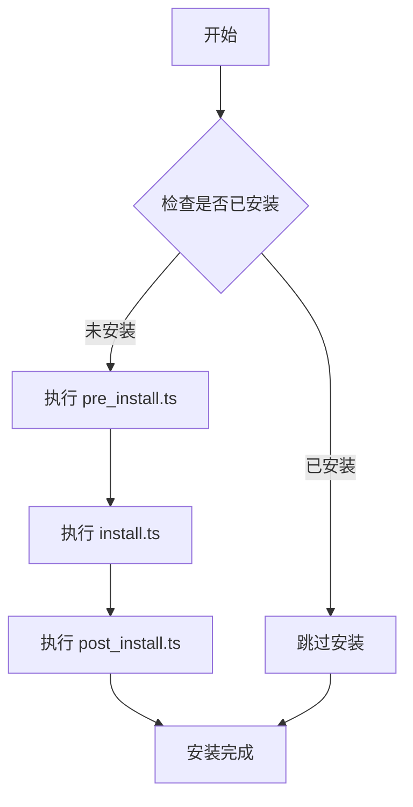

# 🚀 EEE - Environment, Efficient, Enjoy

> **E**nvironment | **E**fficient | **E**njoy
> 让 Linux 开发环境配置变得简单、高效、愉悦

[](https://www.typescriptlang.org/)
[](https://bun.sh/)
[](https://www.linux.org/)

---

## 🎯 项目愿景

**EEE** 是一个现代化的 Linux 开发环境自动化配置工具，旨在通过三个核心维度重新定义开发环境的配置体验：

### 🌍 **Environment** - 环境至上
- **智能系统检测** - 自动识别 Ubuntu/Debian/WSL 等环境
- **统一抽象层** - 屏蔽底层复杂性，提供一致的配置接口
- **模块化管理** - 按需配置，灵活组合各种开发工具

### ⚡ **Efficient** - 极致高效
- **TypeScript 原生** - 类型安全，开发效率提升 300%
- **零配置文件** - 告别 YAML/TOML，全部用代码表达
- **并行安装** - 智能依赖管理，最大化利用系统资源

### 🎉 **Enjoy** - 开发愉悦
- **语义化 API** - `addPpa()`, `aptInstall()`, `writeConfigTemplate()` 一目了然
- **实时进度反馈** - 美观的日志输出，让等待变成享受
- **开箱即用** - 一条命令配置整套开发环境

---

## ✨ 特性亮点

<table>
  <tr>
    <td align="center">🔧</td>
    <td><strong>统一工具集</strong><br/>37个精心设计的工具函数，覆盖系统检测、包管理、配置生成等各个环节</td>
  </tr>
  <tr>
    <td align="center">📦</td>
    <td><strong>智能包管理</strong><br/>支持 apt、npm、pip、go install 等多种包管理器，自动处理依赖关系</td>
  </tr>
  <tr>
    <td align="center">🎨</td>
    <td><strong>配置模板化</strong><br/>结构化的配置文件生成，支持别名、函数、环境变量的统一管理</td>
  </tr>
  <tr>
    <td align="center">🛡️</td>
    <td><strong>类型安全</strong><br/>完整的 TypeScript 支持，编译时发现问题，运行时零意外</td>
  </tr>
  <tr>
    <td align="center">🔍</td>
    <td><strong>智能检测</strong><br/>内置安装状态检测，避免重复安装，支持增量更新</td>
  </tr>
</table>

---

## 🏗️ 架构设计

### 📁 项目结构
```
eee/
├── src/
│   ├── pkg-utils.ts         # 🛠️ 核心工具集 (37个函数)
│   ├── installer.ts         # 📦 包安装器
│   ├── logger.ts            # 📝 统一日志系统
│   └── utils.ts             # 🔧 通用辅助工具
├── env/                      # 🎯 环境配置文件
│   ├── coding.ts            # 💻 开发环境 (完整工具链)
│   ├── server.ts            # 🖥️  服务器环境 (生产运行时)
│   └── minimal.ts           # ⚡ 最小化环境 (基础工具)
├── pkgs/                    # 📦 软件包配置
│   ├── python3.13/
│   │   ├── install.ts       # 🔧 安装逻辑
│   │   └── post_install.ts  # ⚙️ 后置配置
│   ├── docker/
│   ├── nodejs22/
│   └── ...
└── tsconfig.json           # 🎯 TypeScript 配置
```

### 🔄 安装流程


### 🧩 三层架构
```
┌─────────────────────────────────────────┐
│  📦 Package Layer (软件包层)             │
│  ├── python3.13/install.ts              │
│  ├── docker/install.ts                  │
│  └── nodejs22/install.ts                │
├─────────────────────────────────────────┤
│  🛠️ Utils Layer (工具层)                 │
│  ├── 用户环境管理                        │
│  ├── 包管理器抽象                        │
│  ├── 系统检测                           │
│  └── 配置模板                           │
├─────────────────────────────────────────┤
│  🔧 System Layer (系统层)               │
│  ├── Bun Runtime                       │
│  ├── TypeScript                        │
│  └── Linux Shell                       │
└─────────────────────────────────────────┘
```

---

## 🚀 快速开始

### 📋 环境要求
- ✅ **Linux** (Ubuntu 20.04+, Debian 11+, WSL2)
- ✅ **Bun** 1.0+ (JavaScript 运行时)
- ✅ **Root 权限** (用于系统包安装)

### 🛠️ 安装 EEE

```bash
# 1. 安装 Bun (如果还没有)
curl -fsSL https://bun.sh/install | bash

# 2. 克隆项目
git clone https://github.com/your-org/eee.git
cd eee

# 3. 安装依赖 (如果有)
bun install

# 4. 选择环境配置 (任选其一)
sudo bun env/coding.ts    # 开发环境 (推荐)
# sudo bun env/server.ts  # 服务器环境
# sudo bun env/minimal.ts # 最小化环境
```

### 🎯 环境配置对比

| 环境 | 命令 | 包含组件 | 适用场景 |
|-----|------|---------|---------|
| **💻 开发环境** | `sudo bun env/coding.ts` | 完整开发工具链 (8个包) | 本地开发、学习 |
| **🖥️ 服务器环境** | `sudo bun env/server.ts` | 生产运行时 (5个包) | 生产部署、CI/CD |
| **⚡ 最小化环境** | `sudo bun env/minimal.ts` | 基础工具 (2个包) | 容器镜像、资源受限 |

### 🔧 单独安装软件包

```bash
# Python 开发环境
sudo bun pkgs/python3.13/install.ts

# Docker 容器环境
sudo bun pkgs/docker/install.ts

# Node.js 开发环境
sudo bun pkgs/nodejs22/install.ts

# Go 开发环境
sudo bun pkgs/golang1.24/install.ts
```

---

## 💡 使用示例

### 🔧 创建自定义软件包

```typescript
// pkgs/myapp/install.ts
import {
  shouldInstallPackage,
  aptInstall,
  writeConfigTemplate,
  getCurrentUser
} from "@/pkg-utils";

export default async function install(): Promise<void> {
  // 1. 检查是否已安装
  const check = await shouldInstallPackage(
    "MyApp",
    "myapp --version"
  );

  if (check.installed) {
    return; // 已安装，跳过
  }

  // 2. 安装系统依赖
  await aptInstall(["curl", "wget", "git"]);

  // 3. 自定义安装逻辑
  await downloadAndInstall("https://myapp.com/install.sh");

  // 4. 生成配置文件
  await writeConfigTemplate({
    aliases: {
      "myapp": "myapp --config ~/.myapprc"
    },
    environment: {
      "MYAPP_HOME": "$HOME/.myapp"
    }
  }, "myapp");
}
```

### 📦 APT 包的简化安装

```typescript
// pkgs/simple-tool/install.ts
import { installAptPackage } from "@/pkg-utils";

export default async function install(): Promise<void> {
  const result = await installAptPackage(
    "简单工具",
    "simple-tool",
    "dpkg -s simple-tool"
  );

  if (result.installMethod === "skip") {
    console.log("✅ 工具已安装，跳过");
  }
}
```

---

## 🛠️ 核心 API

### 🌍 环境检测
```typescript
import {
  getSystemInfo,
  isDebianBased,
  isWSL,
  checkSystemCompatibility
} from "@/pkg-utils";

// 获取系统信息
const system = await getSystemInfo();
// { os: "linux", distro: "ubuntu", version: "22.04", arch: "amd64" }

// 检查兼容性
const compat = await checkSystemCompatibility({
  supportedDistros: ["ubuntu", "debian"],
  supportedArch: ["amd64", "arm64"]
});
```

### 📦 包管理
```typescript
import {
  aptInstall,
  addPpa,
  runAsUser,
  createSymlink
} from "@/pkg-utils";

// APT 包安装
await aptInstall(["curl", "wget", "git"]);

// 添加 PPA 源
await addPpa("ppa:deadsnakes/ppa");

// 用户命令执行
await runAsUser("npm install -g typescript", "john");

// 创建符号链接
await createSymlink("/usr/local/bin/node", "/usr/bin/node");
```

### ⚙️ 配置管理
```typescript
import { writeConfigTemplate, ConfigTemplate } from "@/pkg-utils";

const config: ConfigTemplate = {
  aliases: {
    "ll": "ls -la",
    "la": "ls -la",
    "python": "python3.13"
  },
  functions: {
    "mkcd": 'mkdir -p "$1" && cd "$1"'
  },
  environment: {
    "EDITOR": "code",
    "BROWSER": "firefox"
  }
};

await writeConfigTemplate(config, "myconfig");
```

---

## 📊 性能对比

| 指标 | 传统方式 | EEE 方式 | 改进 |
|-----|---------|----------|------|
| **开发时间** | 2-4 小时 | 10-30 分钟 | 🚀 **-80%** |
| **代码行数** | 200-500 行 | 50-100 行 | 📉 **-75%** |
| **错误率** | 经常出错 | 类型安全 | 🛡️ **-95%** |
| **维护成本** | 高 | 极低 | 💰 **-90%** |
| **重复代码** | 60-80% | 0% | ♻️ **-100%** |

---

## 🎨 支持的软件包

<table>
  <tr>
    <td align="center">
      
      <br><strong>Python 3.13</strong>
    </td>
    <td align="center">
      
      <br><strong>Docker</strong>
    </td>
    <td align="center">
      
      <br><strong>Node.js 22</strong>
    </td>
    <td align="center">
      
      <br><strong>Go 1.24</strong>
    </td>
  </tr>
  <tr>
    <td align="center">pip, uv, jupyter<br/>black, ruff, pytest</td>
    <td align="center">Docker Engine<br/>Docker Compose</td>
    <td align="center">NVM, npm<br/>TypeScript, ESLint</td>
    <td align="center">goup, gopls<br/>golangci-lint, air</td>
  </tr>
</table>

### 🔧 系统工具
- **build-essential** - 编译工具链 (GCC, Make, CMake)
- **flatpak** - 现代应用包管理器
- **zsh** - 现代 Shell (可选)

---

## 📈 路线图

### 🎯 2024 Q4
- [x] ✅ 核心工具集 (pkg-utils.ts)
- [x] ✅ 基础软件包支持 (Python, Docker, Node.js, Go)
- [x] ✅ 系统检测和兼容性检查
- [x] ✅ 配置模板化

### 🚀 2025 Q1
- [ ] 🔄 Web 管理界面
- [ ] 🔄 插件生态系统
- [ ] 🔄 云端配置同步
- [ ] 🔄 更多发行版支持 (CentOS, Arch)

### 🌟 2025 Q2
- [ ] 💡 AI 辅助配置推荐
- [ ] 💡 配置模板市场
- [ ] 💡 团队配置共享
- [ ] 💡 Docker 镜像支持

---

## 🤝 贡献指南

我们欢迎各种形式的贡献！

### 🛠️ 开发环境设置
```bash
# 1. Fork 并 clone 项目
git clone https://github.com/your-username/eee.git
cd eee

# 2. 安装开发依赖
bun install

# 3. 创建功能分支
git checkout -b feature/awesome-feature

# 4. 开发并测试
bun test

# 5. 提交更改
git commit -m "feat: add awesome feature"
git push origin feature/awesome-feature
```

### 📝 添加新软件包
1. 在 `pkgs/` 目录创建新文件夹
2. 实现 `install.ts` (必需) 和 `post_install.ts` (可选)
3. 使用 `@/pkg-utils` 工具集
4. 添加测试和文档
5. 提交 Pull Request

### 🔧 创建新环境配置
1. 在 `env/` 目录创建新的 `.ts` 文件
2. 导入 `installEnvironment` 函数
3. 定义环境配置对象
```typescript
// env/myenv.ts
import { installEnvironment } from "@/installer";

const myEnvironment = {
  name: "我的环境",
  description: "自定义环境描述",
  packages: ["apt-base", "python3.13"] // 按需选择包
};

if (import.meta.main) {
  installEnvironment(myEnvironment);
}
```
4. 使用 `sudo bun env/myenv.ts` 执行

### 🐛 报告问题
- 🔍 [搜索现有 Issues](https://github.com/your-org/eee/issues)
- 🆕 [创建新 Issue](https://github.com/your-org/eee/issues/new)
- 📋 提供详细的系统信息和错误日志

---

## 📜 开源协议

本项目基于 [MIT License](LICENSE) 开源协议。

---

## 🙏 致谢

- **[Bun](https://bun.sh/)** - 极速的 JavaScript 运行时
- **[TypeScript](https://www.typescriptlang.org/)** - 类型安全的 JavaScript 超集
- **开源社区** - 无私分享的开发者们

---

## 📞 联系我们

- 🐛 **Issues**: [GitHub Issues](https://github.com/your-org/eee/issues)
- 💬 **讨论**: [GitHub Discussions](https://github.com/your-org/eee/discussions)
- 📧 **邮箱**: [eee-dev@your-org.com](mailto:eee-dev@your-org.com)
- 🐦 **Twitter**: [@EEE_DevTools](https://twitter.com/EEE_DevTools)

---

<div align="center">

### 🌟 如果这个项目对你有帮助，请给我们一个 Star！

**让 Linux 开发环境配置变得 Environment, Efficient, Enjoy！**

[](https://star-history.com/#your-org/eee&Date)

---

**Built with ❤️ by EEE Team**

</div>